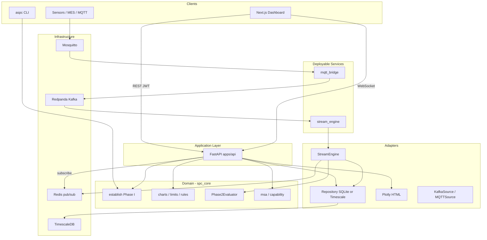
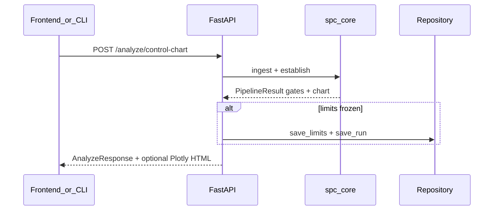
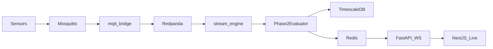

# ASPC structural & architectural scan

ASPC is a **hexagonal / clean-layered modular monolith** for production Statistical Process Control. Pure math lives in `spc_core/`; I/O and persistence in `adapters/`; HTTP/CLI in `apps/`; long-running stream workers in `services/`. Deployable as library + CLI, or as a Compose stack (API, stream-engine, mqtt-bridge + Redpanda, Mosquitto, TimescaleDB, Redis, Next.js UI).

**Primary pattern:** hexagonal / ports-and-adapters (not classic MVC microservices). One shared Python package (`aspc`), three optional long-running processes, shared domain library.

**Domain contract:** Phase I (`establish`) gates and freezes versioned limits → Phase II (`Phase2Evaluator`) evaluates new points against frozen limits and never recomputes them.

---

## High-level system architecture

---

## Key folders and responsibilities

| Path | Responsibility |
|------|----------------|
| [`spc_core/`](../spc_core/) | Pure statistics: ingest, cleaning, normality/multimodal gates, Shewhart/EWMA/CUSUM, rules, MSA, capability, `establish()` pipeline, `Phase2Evaluator`, report models |
| [`adapters/`](../adapters/) | Side effects: file I/O, SQLite/Timescale repos, Plotly, Kafka/MQTT sources, `StreamEngine`, SQLAlchemy models |
| [`apps/api/`](../apps/api/main.py) | FastAPI: auth, batch analyze, runs/reports, stream registry/go-live, WS live, SSE replay |
| [`apps/cli/`](../apps/cli/main.py) | `aspc` CLI (`control-chart`, `capability`, `msa`, `serve`, `doctor`, `demo`, `resilience`) |
| [`apps/config.yaml`](../apps/config.yaml) + [`apps/config.py`](../apps/config.py) | YAML defaults + `ASPC_*` env overrides |
| [`services/stream_engine/`](../services/stream_engine/main.py) | Kafka consumer process → Phase II → DB + Redis |
| [`services/mqtt_bridge/`](../services/mqtt_bridge/main.py) | MQTT → Redpanda producer |
| [`frontend/`](../frontend/) | Next.js 14 operator UI (onboarding, analyze, MSA, capability, live, lab, runs) |
| [`deploy/`](../deploy/) | Compose, Dockerfiles, Mosquitto, Grafana, Vercel helpers |
| [`migrations/`](../migrations/) | Alembic (Timescale hypertables + analysis tables) |
| [`combinatorial/`](../combinatorial/) | Finite batch + in-process Phase II matrix + engine behavior report |
| [`tests/`](../tests/) | unit / integration / resilience / combinatorial / load |
| [`resilience_data/`](../resilience_data/) | Standards-mapped CSV corpus + MANIFEST expects |
| [`docs/`](./) | Product overview, API, config, deploy, pipeline concepts |
| [`sample_data/`](../sample_data/), [`examples/`](../examples/), [`benchmarks/`](../benchmarks/), [`scripts/`](../scripts/) | Demo data, accuracy/perf benches, live sims, resilience tooling |

---

## Critical dependencies and configuration

### Tech stack

- **Language:** Python 3.11+ (core/services); TypeScript/React 18 (UI)
- **Stats:** NumPy, SciPy, Pydantic, diptest; optional Polars, Plotly
- **API:** FastAPI, Uvicorn, JWT (`python-jose`), API keys, SlowAPI, Prometheus, Structlog
- **Frontend:** Next.js 14 App Router, TanStack Query, Plotly, Tailwind
- **Persistence:** SQLite (local default) or TimescaleDB/Postgres (streaming/prod) via SQLAlchemy async + Alembic
- **Streaming:** Redpanda (Kafka API), Mosquitto MQTT, Redis pub/sub
- **Packaging:** [`pyproject.toml`](../pyproject.toml) + [`uv.lock`](../uv.lock); console scripts `aspc`, `aspc-api`, `aspc-stream-engine`, `aspc-mqtt-bridge`

### Core config surfaces

- [`apps/config.yaml`](../apps/config.yaml) — API/CORS, auth, uploads, persistence backend, Redis, Kafka, SPC ruleset / Phase I thresholds
- [`env.example`](../env.example) — `ASPC_JWT_SECRET`, admin, API keys, `ASPC_DEV_INSECURE`, DSN, Redis, Kafka
- [`frontend/.env.example`](../frontend/.env.example) — `NEXT_PUBLIC_API_URL`, `NEXT_PUBLIC_WS_URL`
- [`deploy/compose/docker-compose.yml`](../deploy/compose/docker-compose.yml) — full stack orchestration

### Persistence models ([`adapters/db_models.py`](../adapters/db_models.py))

- Batch: `control_limits`, `analysis_runs`, `audit_log`, `capability_history`
- Streaming: `raw_measurements` (hypertable), `ooc_events`, `stream_registry`

Streaming path requires Timescale (`save_raw_measurement`); SQLite is batch/prototype only.

---

## Domain modules (`spc_core`)

- **Models:** [`models.py`](../spc_core/models.py) — `ChartType`, `ControlLimits`, `LimitSet`, `Signal`, `SPCRecord`
- **Pipeline:** [`pipeline.py`](../spc_core/pipeline.py) — `Gate`, `establish`, `phase1_checklist`, `checklist_ready_for_golive`
- **Charts / limits / rules:** [`charts.py`](../spc_core/charts.py), [`limits.py`](../spc_core/limits.py), [`rules.py`](../spc_core/rules.py)
- **Phase II:** [`evaluator.py`](../spc_core/evaluator.py) — `Phase2Evaluator`, `evaluate_batch`
- **Explain:** [`explain.py`](../spc_core/explain.py) — `explain_signal` (deterministic operator text)
- **MSA / capability:** [`msa.py`](../spc_core/msa.py), [`capability.py`](../spc_core/capability.py)
- **Ingest / cleaning / gates:** [`ingest.py`](../spc_core/ingest.py), [`cleaning.py`](../spc_core/cleaning.py), [`normality.py`](../spc_core/normality.py), [`multimodal.py`](../spc_core/multimodal.py)

---

## API surface ([`apps/api/main.py`](../apps/api/main.py))

| Area | Endpoints |
|------|-----------|
| Ops | `GET /`, `/health`, `/metrics` (JWT), `/ops/summary` |
| Auth | `POST /auth/token`, `GET /auth/me` |
| Batch analyze | `POST /analyze/control-chart`, `/analyze/capability`, `/analyze/msa`, `/analyze/explain` |
| Onboarding / lab | `GET /onboarding/sample`, `POST /onboarding/demo-stream`, `GET /lab/cases`, `POST /lab/cases/{id}/run` |
| History | `GET /runs`, `/runs/{id}`, `/reports/{id}` |
| Live control | `POST /streams/register`, `/streams/{key}/go-live`, `GET /streams`, `POST /alerts/{id}/ack` |
| Live data | `WS /ws/live/{stream_key}` (first-message JWT), `GET /stream/replay` (SSE) |

**Auth:** JWT Bearer for analyze/UI; API keys (`X-API-Key`) for stream register/go-live/ack; WebSocket auth is the first JSON frame `{"type":"auth","token"}` (not a query param). Startup refuses insecure defaults unless `ASPC_DEV_INSECURE=1`.

See also [api.md](api.md) for request/response detail.

---

## Main data / request flows

### A. Batch Phase I (HTTP)

1. Upload CSV → `load_columns` / `ingest`
2. `establish(...)` runs gate sequence (ok/warn/stop) + chart
3. If frozen: persist versioned limits + run metadata
4. Optional Plotly report; checklist for go-live readiness

Capability/MSA follow the same app path with `capability_analysis` / Gage R&R entry points.

### B. Go-live → Phase II registration

1. `POST /streams/register` then `POST /streams/{key}/go-live` (JWT + API key)
2. Validates frozen limits / checklist → `repo.register_stream(active=True)`
3. `stream_engine` loads limits via `StreamEngine.load_limits`

### C. Live streaming (MQTT → UI)

1. MQTT message → [`mqtt_bridge`](../services/mqtt_bridge/main.py) normalizes → Kafka topic
2. [`stream_engine`](../services/stream_engine/main.py) → `StreamEngine.handle_message` → `Phase2Evaluator.observe`
3. Persist Tier-1 raw + Tier-2 OOC events; publish Redis `spc:live:{stream_key}`
4. API `ws_live` subscribes and fans out to the Live page

### D. SSE replay (demo / file-based Phase II)

`GET /stream/replay` → `FileReplaySource` + `stream_evaluate` (no Kafka).

---

## Frontend map ([`frontend/src/app/`](../frontend/src/app/))

| Route | Role |
|-------|------|
| `/` | Overview: health, runs, streams |
| `/login` | JWT login |
| `/onboarding` | Sample → establish → go-live wizard |
| `/analyze`, `/capability`, `/msa` | Batch upload workflows |
| `/live` | Phase II WebSocket + alerts + go-live |
| `/lab` | Resilience catalog browse/run |
| `/runs`, `/runs/[run_id]` | Run history + report |

REST from the browser uses same-origin **`/backend/*`**, rewritten by Next.js to the API (`ASPC_API_PROXY_TARGET`, Compose default `http://api:8000`). Clients: [`frontend/src/lib/api.ts`](../frontend/src/lib/api.ts), [`ws.ts`](../frontend/src/lib/ws.ts).

---

## Deploy topology (Compose)

| Service | Port | Role |
|---------|------|------|
| `api` | 8000 | FastAPI |
| `frontend` | 3000 | Next.js |
| `redpanda` | 19092 | Kafka bus |
| `mosquitto` | 1883 | MQTT |
| `timescaledb` | 5433 | Persistence |
| `redis` | 6379 | Live fan-out |
| `stream-engine` | — | Phase II worker |
| `mqtt-bridge` | — | MQTT → Kafka |
| `migrate` | — | Alembic once |
| `grafana` (ops profile) | 3001 | Timescale dashboards |

Full ops notes: [deployment.md](deployment.md).

---

## Tests & quality evidence

- **Unit:** [`tests/unit/`](../tests/unit/) — core math, pipeline, API, security, stream
- **Integration:** [`tests/integration/`](../tests/integration/) — batch e2e + realtime (gated on Timescale/Redis)
- **Resilience:** [`tests/resilience/`](../tests/resilience/) + [`resilience_data/`](../resilience_data/) — parametrized catalog asserting gates/rules
- **Combinatorial:** [`combinatorial/`](../combinatorial/) + [`tests/combinatorial/`](../tests/combinatorial/) — batch/stream matrix, sparse in CI
- **Load:** Locust in [`tests/load/`](../tests/load/)
- **Frontend:** Vitest + Playwright (`frontend/e2e/`, stack-required except `home.spec.ts`)
- **CI:** [`.github/workflows/ci.yml`](../.github/workflows/ci.yml) — ruff, mypy, pytest, resilience + sparse combinatorial, benches, frontend build, Docker images

Contributor workflow: [development.md](development.md).

---

## Summary

ASPC separates **correct SPC math** (`spc_core`) from **I/O and ops** (`adapters` / `apps` / `services`). Batch analysis is a classic request → domain → repository flow; real-time monitoring is an event pipeline (MQTT → Kafka → evaluator → Timescale/Redis → WebSocket). The architectural spine is the Phase I freeze contract: limits are established under gates, versioned, then evaluated in Phase II without recomputation.

Health insights, quick wins, and enterprise roadmap: [overview/health-and-roadmap.md](overview/health-and-roadmap.md).
