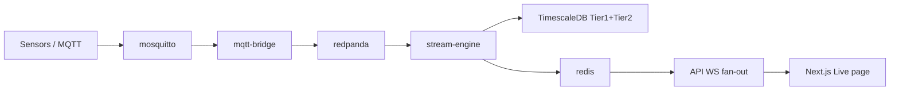

# Deployment

## Docker Compose (full stack)

Compose file: [`deploy/compose/docker-compose.yml`](../deploy/compose/docker-compose.yml).

```bash
cp deploy/compose/.env.example deploy/compose/.env   # edit secrets
docker compose -f deploy/compose/docker-compose.yml --env-file deploy/compose/.env up -d --build
```

Containers use `restart: "no"` (do not auto-start on Docker/daemon reboot). Start explicitly with `compose up`; stop with `compose down`.

| Service | Role | Host port |
|---------|------|-----------|
| `migrate` | `alembic upgrade head` (runs once before api/stream-engine) | — |
| `api` | FastAPI | 8000 |
| `frontend` | Next.js dashboard | 3000 |
| `redpanda` | Kafka-compatible broker | `127.0.0.1:19092`, `127.0.0.1:9644` |
| `mosquitto` | MQTT broker | `127.0.0.1:1883` |
| `timescaledb` | Tier-1/Tier-2 persistence | `127.0.0.1:5433` → 5432 |
| `redis` | Live alert pub/sub | `127.0.0.1:6379` |
| `stream-engine` | Kafka → Phase II eval → DB + Redis | — |
| `mqtt-bridge` | MQTT → Redpanda | — |
| `grafana` | Ops dashboards (`--profile ops`) | `127.0.0.1:3001` |

Infra ports (Redpanda, Mosquitto, Timescale, Redis, Grafana) bind to **loopback only** so they are not reachable from the LAN. API and frontend remain on `0.0.0.0` for local browser access.

Secrets come from `deploy/compose/.env` (never commit real values):

- `POSTGRES_PASSWORD`, `ASPC_JWT_SECRET`, `ASPC_API_KEYS`, `ASPC_ADMIN_PASSWORD`
- `ASPC_CORS_ORIGINS=http://localhost:3000,http://127.0.0.1:3000,http://localhost:3001,http://127.0.0.1:3001`
- `ASPC_TSDB_INIT=0` on api/stream-engine so only the migrate service applies schema
- `PYTHONPATH=/app` on the API container so `/lab/cases` can import `resilience_data`

**MQTT auth (required before non-local use):** Compose ships Mosquitto with `allow_anonymous true` for local demos only ([`deploy/mosquitto/mosquitto.conf`](../deploy/mosquitto/mosquitto.conf)). Before exposing the stack beyond localhost, add a Mosquitto password file (or TLS client certs), set `allow_anonymous false`, and prefer keeping `1883` off the host network entirely.

Other deferred ops: continuous aggregates, image digest pins.

**Kafka DLQ:** Unparseable measurement payloads are forwarded to
`ASPC_KAFKA_DLQ_TOPIC` (default `{topic}.dlq`, e.g. `spc.measurements.dlq`) instead of
crashing the stream engine. Monitor that topic in production.

**Multi-tenant scaffolding:** Alembic revision `002_tenant_watermark` adds nullable
`tenant_id` columns and a `stream_registry.measurement_count` watermark. Filtering /
RBAC is not wired yet — columns are reserved for enterprise tenancy.

Frontend `NEXT_PUBLIC_API_URL` / `NEXT_PUBLIC_WS_URL` / `ASPC_API_PROXY_TARGET` are **Docker build-args** (Next.js bakes them at build time). Defaults: API via same-origin `/backend` (Next rewrites to `http://api:8000` inside Compose), WebSocket `ws://localhost:8000`. Override via compose `.env` and rebuild the frontend image.

Ops profile:

```bash
docker compose -f deploy/compose/docker-compose.yml --env-file deploy/compose/.env --profile ops up -d
```

## Docker images

Python images use [uv](https://docs.astral.sh/uv/) (`COPY --from=ghcr.io/astral-sh/uv:latest`):

- [`deploy/docker/Dockerfile.api`](../deploy/docker/Dockerfile.api) → `aspc-api`
- [`deploy/docker/Dockerfile.stream_engine`](../deploy/docker/Dockerfile.stream_engine) → `aspc-stream-engine`
- [`deploy/docker/Dockerfile.mqtt_bridge`](../deploy/docker/Dockerfile.mqtt_bridge) → `aspc-mqtt-bridge`
- [`deploy/docker/Dockerfile.frontend`](../deploy/docker/Dockerfile.frontend) → Next.js (npm)

## Data path (real-time)



1. Edge publishes to Mosquitto (`sensors/#` by default).
2. `mqtt-bridge` forwards to Kafka topic `spc.measurements`.
3. `stream-engine` evaluates each keyed stream against **frozen** limits, writes raw + OOC events, publishes to Redis `spc:live:{stream_key}` (or `spc:live:{tenant_id}:{stream_key}` when `ASPC_TENANT_ID` / `ASPC_REDIS_TENANT_PREFIX` is set). Optional signed OOC webhooks use `ASPC_WEBHOOK_URL` / stream `meta.webhook_url`.
4. For multi-replica stream-engine demos, pin Kafka consumers with sticky assignment per `stream_key` partition so Phase II evaluator state stays local.
4. API WebSocket `/ws/live/{stream_key}` fans out to the dashboard.

Go-live requires Timescale stream registry: Phase I analysis → `limits_version` → `POST /streams/{key}/go-live`.

## Migrations (TimescaleDB)

Alembic:

- Config: [`alembic.ini`](../alembic.ini)
- Env: [`migrations/env.py`](../migrations/env.py)
- Initial: [`migrations/versions/001_initial.py`](../migrations/versions/001_initial.py) (hypertables + analysis tables)

Point `ASPC_TIMESCALE_DSN` / Alembic URL at the database and run:

```bash
uv pip install -e ".[tsdb]"
alembic upgrade head
```

(Compose may rely on repository bootstrap depending on your ops practice; prefer explicit migrations in production.)

## Observability

- `GET /metrics` — Prometheus counters/histograms when `prometheus-client` is installed (JWT required)
- Grafana optional profile on port 3001
- Structured logging via `structlog` in the apps extras

## Minimal local (no Compose)

SQLite + API + optional frontend:

```bash
uv pip install -e ".[dev]"
aspc serve --port 8000
# another shell:
cd frontend && cp .env.example .env.local && npm install && npm run dev
```

Streaming features need Redis / Kafka / Timescale as above.
