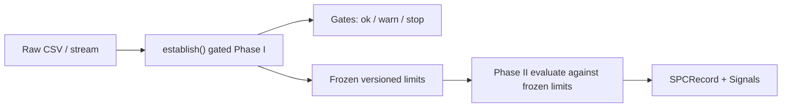

# ASPC documentation

ASPC is a production Statistical Process Control platform: a pure statistics core (`spc_core`), thin adapters for I/O and persistence, a FastAPI + CLI surface, real-time streaming (Redpanda / MQTT / Redis), and a Next.js operator dashboard.

Every advertised chart type has real math. Phase I establishes and **freezes** versioned control limits; Phase II evaluates new data against those frozen limits—never recomputes them.

## Mental model: Phase I → freeze → Phase II

1. **Phase I** — Run the gated pipeline (`establish`) on historical / baseline data. MSA, missing-value classification, autocorrelation, normality / multimodal checks, and chart selection produce gates with status `ok`, `warn`, or `stop`.
2. **Freeze** — Control limits are content-hashed (`limits.version`). That version is the contract Phase II must consume.
3. **Phase II** — New observations are scored against the frozen limits (batch `evaluate_batch` / `stream_evaluate`, or the live stream engine). Out-of-control conditions become `Signal`s on per-point `SPCRecord`s.

Go-live is gated by `phase1_checklist()` (10 items). Streams register and activate via the API (`/streams/register` → `/streams/{key}/go-live`) when using the TimescaleDB backend.

## Doc map

| Doc | Audience | Contents |
|-----|----------|----------|
| [overview/problem-and-solution.md](overview/problem-and-solution.md) | Decision-makers & practitioners | Problem, solution, architecture diagrams |
| [overview/capabilities.md](overview/capabilities.md) | Practitioners & developers | Statistical + operational capabilities |
| [overview/use-cases.md](overview/use-cases.md) | Integrators | Stamping / pharma / molding patterns |
| [overview/benchmarking.md](overview/benchmarking.md) | Technical leads | Performance, accuracy, resilience evidence |
| [concepts.md](concepts.md) | Everyone | Chart types, run rules, MSA, capability, normality / flags |
| [pipeline.md](pipeline.md) | Operators & developers | Gated `establish()`, gates, checklist, `SPCRecord` |
| [cli.md](cli.md) | Operators & developers | `aspc` commands and flags |
| [api.md](api.md) | Integrators | REST, JWT / API-key auth, WebSocket, SSE |
| [python-api.md](python-api.md) | Developers | Library imports and snippets |
| [configuration.md](configuration.md) | Operators & DevOps | YAML + `ASPC_*` env overrides |
| [deployment.md](deployment.md) | DevOps | Docker Compose, migrations, services |
| [development.md](development.md) | Contributors | uv, tests, CI, `sample_data`, benchmarks |

## Quick links

- Root [README](../README.md) — install and one-command quickstart
- Interactive OpenAPI — `http://localhost:8000/docs` when the API is running
- Standards — AIAG MSA-4 · AIAG SPC · ISO 7870 · Six Sigma DMAIC
