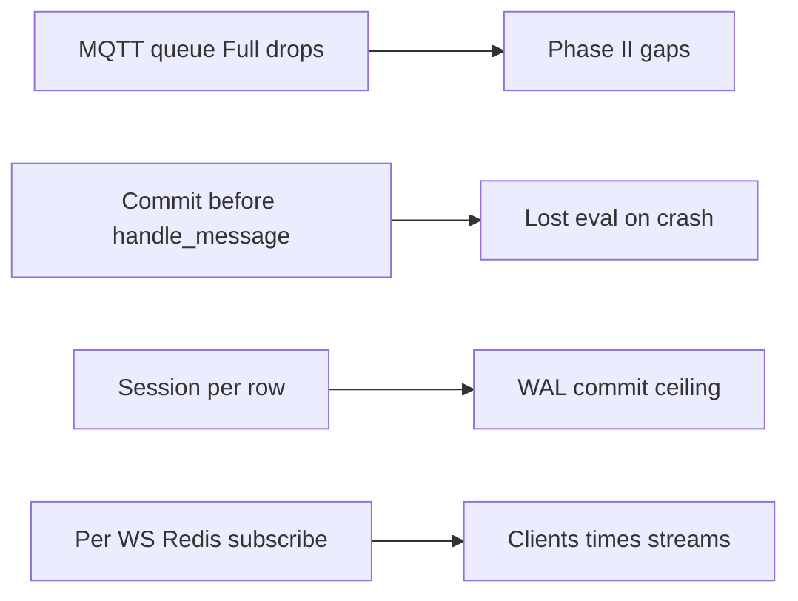
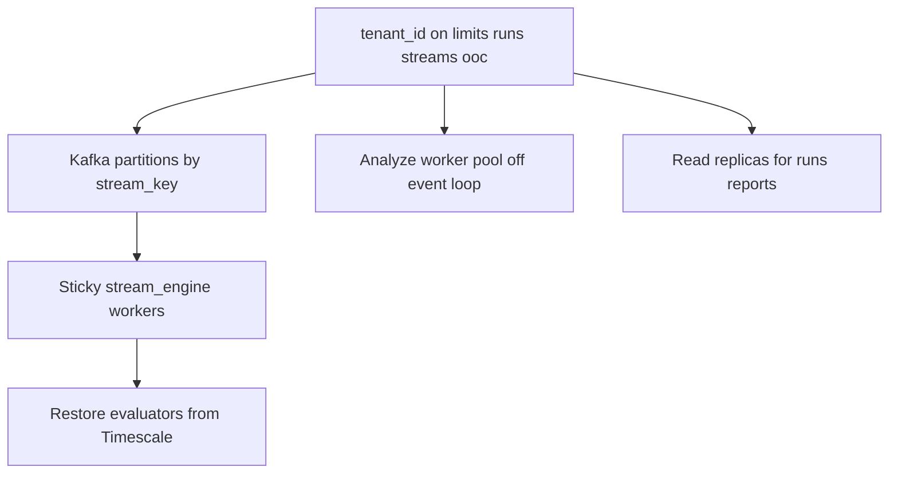

# ASPC deep analysis: health, optimizations, roadmap

Evidence-based review of the hexagonal Phase I → freeze → Phase II platform. Strengths first: `spc_core` math is real (not stubbed), freeze contract is clear, resilience catalog + CI are unusually strong for an SPC product. Gaps concentrate in auth flatness, streaming durability, API monolith size, Timescale write amplification, and incomplete variable-limit Phase II zone rules.

**Superseded vs current tree:** the [Implementation status](#implementation-status-roadmap) list at the bottom is the source of truth for work already landed. It supersedes several §1 findings: operator go-live UI (Live register / go-live / ack, `/onboarding`), WebSocket first-message JWT (no query-string token), JWT-protected `/metrics`, and JWT-only analyze identity. Leave the remaining rows in §1 as open (write amp, variable-limit Phase II, RBAC/tenancy, Kafka at-most-once, MQTT drop-on-full).

Companion structural map: [architecture.md](../architecture.md).

---

## 1. Codebase health and deep insights

### Architectural bottlenecks

- **Monolithic API surface:** [`apps/api/main.py`](../../apps/api/main.py) (~900 lines) owns auth, uploads, three analyze pipelines, runs/reports, stream registry, WebSocket, SSE, health, and metrics. Module-level singletons `cfg` / `repo` make tests mutate globals and complicate multi-worker ASGI.
- **Single sync stream consumer:** [`services/stream_engine/main.py`](../../services/stream_engine/main.py) iterates `source.iter_sync()` in one process. Compose runs one `stream-engine` replica. Hot path is sync despite async-capable [`KafkaSource`](../../adapters/stream_sources.py) / [`MQTTSource`](../../adapters/stream_sources.py).
- **Write amplification on the live path:** [`TimescaleDBRepository.save_raw_measurement`](../../adapters/persistence_tsdb.py) / `save_ooc_event` open a new SQLAlchemy `Session` + `commit` per row. One observation ≈ 1 raw insert + N OOC inserts + Redis publish — not batched.
- **MQTT bridge flush-per-message:** [`services/mqtt_bridge/main.py`](../../services/mqtt_bridge/main.py) `_produce_kafka` calls `producer.flush()` (or `send_and_wait`) after every send — hard throughput ceiling.
- **In-memory evaluator ownership:** [`StreamEngine`](../../adapters/stream_engine.py) keeps up to `max_streams=10_000` `Phase2Evaluator`s in an OrderedDict with LRU eviction. Horizontal scale without sticky partition ownership duplicates state or cold-restores incorrectly.
- **Redis pub/sub fan-out:** Engine publishes `spc:live:{key}`; each [`ws_live`](../../apps/api/main.py) client opens its own Redis subscription. Cost scales with streams × clients; no durable replay buffer (history is Timescale-only → live/history split-brain if Redis fails after DB write).

### Technical debt and brittle patterns

- **Duck-typed streaming repository:** API uses `hasattr(repo, "register_stream")` etc. instead of a typed `StreamRepository` protocol — SQLite vs Timescale silently changes which routes return 501.
- **Go-live policy split:** Freeze rules live in [`establish`](../../spc_core/pipeline.py); HTTP [`go_live`](../../apps/api/main.py) re-checks checklist/frozen/stopped from `meta` written by `analyze_cc`. Easy to drift.
- **Checklist vs freeze asymmetry:** MSA absence **warns** the MSA gate (can still freeze) but **fails** `phase1_checklist()` item `msa_grr_ndc` — operators can freeze while go-live is blocked.
- **Variable-limit Phase II incomplete:** [`Phase2Evaluator._observe_variable`](../../spc_core/evaluator.py) only applies beyond-limits + run-of-9 style logic — not full Nelson 3–8 / Western Electric zone rules that use-cases imply for streaming P charts.
- **Transform / subgroup alignment risk:** `establish()` can set `working = transform.values` while still passing original `subgroup_ids` into `analyze_control_chart()` — length mismatch if NaNs dropped then transform ran on cleaned data.
- **Frontend (go-live shipped; polish remains):** Live no longer only lists streams — it registers, go-lives, and acks against the API. `/onboarding` and `/lab` exist. Remaining UI gaps are smaller than this section originally claimed (continuous MSA evaluate is wired; Analyze Phase I knobs are in the form).

### Security vulnerabilities

| Severity | Finding | Where |
|----------|---------|--------|
| High | `ASPC_AUTH_ENABLED=false` skips `_startup_security_checks` and opens analyze/history | [`_startup_security_checks`](../../apps/api/main.py), [`get_current_user`](../../apps/api/main.py) |
| High | ~~Plaintext password fallback if `bcrypt` missing~~ **Closed:** bcrypt required at import | `_ensure_password_hash` / `_verify_password` |
| High | ~~JWT in WebSocket query string (`?token=`)~~ **Closed:** first-message `{"type":"auth","token"}` | `ws_live` |
| High | Single shared admin; no RBAC/tenancy; any JWT sees all runs/streams | token payload is only `sub`+`exp`; `list_runs` has no ownership filter |
| Med | ~~Client-spoofable Form `user_id` on analyze~~ **Closed:** identity from JWT | `analyze_cc` / capability / MSA |
| Med | Rate limit still soft-fails if SlowAPI missing; analyze endpoints are limited when SlowAPI is installed | `_rate_limit` |
| Med | Unauthenticated `/health` (exception strings); ~~`/metrics`~~ **Closed:** JWT | health / metrics handlers |
| Med | ~~Upload overwrite without UUID~~ **Closed:** UUID-prefix in `save_upload_stream` | [`adapters/io_files.py`](../../adapters/io_files.py) |
| Med | ~~HTML report fallback unescaped~~ **Closed:** HTML-escape in report fallback | `get_report_html` |
| Med | Docs/deploy examples with `ASPC_DEV_INSECURE=1` / `admin` password | [`deploy/vercel/README.md`](../../deploy/vercel/README.md) |

Positive: path allowlists (`safe_filename`, `resolve_under`, `_RUN_ID_RE`), go-live gates on frozen limits, Compose secret requirements, solid [`tests/unit/test_security.py`](../../tests/unit/test_security.py) for several cases.

### Hidden dependencies and performance anti-patterns

- **Streaming hard-requires Timescale:** [`StreamEngine.__init__`](../../adapters/stream_engine.py) and [`require_streaming_repository`](../../adapters/factory.py) refuse SQLite; Tier-1/2 + `stream_registry` only on Timescale.
- **Kafka commit before process success:** `_AsyncSourceBase.iter_sync` commits after yield/enqueue, not after `handle_message` — crash after commit ⇒ observation loss (at-most-once); redelivery ⇒ Redis duplicate live points (DB is mostly idempotent via `_measurement_id` + OOC unique constraint).
- **No DLQ:** Poison JSON in Kafka can kill the consumer process (docs explicitly defer DLQ).
- **MQTT drops under backpressure:** paho path `queue.Full` drops observations after 5s timeout — Phase II continuity broken silently.
- **Restore tax:** `_restore_evaluator` runs `count_raw_measurements` (`COUNT(*)`) + recent rows per stream register.
- **`ooc_events` not a hypertable;** no index on `acked` despite `list_ooc_events(unacked_only=True)`.
- **Subgroup MQTT gap:** `_normalise` forces `float(value)` — Xbar subgroup lists supported in `StreamEngine` / `Observation` but not through the bridge.

---

## 2. Immediate optimization opportunities

### Quick wins (days, high ROI)

1. **Fail closed on auth crypto:** Remove plaintext password path; require `bcrypt`. Never skip secret checks solely because auth is off (tie to explicit `ASPC_DEV_INSECURE` only).
2. **Derive identity from JWT only:** Drop Form `user_id`; stop spoofable audit fields.
3. **UUID-prefix uploads** in `save_upload_stream`; HTML-escape report fallback.
4. **Typed `StreamRepository` protocol** in adapters; replace `hasattr` branches in API.
5. **Batch Kafka produce:** Remove per-message `flush()` in mqtt_bridge; batch or linger.
6. **Batch DB writes:** Buffer raw/OOC inserts (multi-row / COPY) in `StreamEngine` with periodic flush; reuse one session per batch.
7. **Rate-limit analyze endpoints** (and fail closed if SlowAPI missing when auth is on).
8. **Move WS auth off query string** (first-message or Sec-WebSocket-Protocol); keep JWT out of access logs.
9. **Split `main.py`** into routers: `auth`, `analyze`, `runs`, `streams`, `live` — same behavior, testable seams.
10. **Expose existing API knobs in Analyze UI:** `ruleset`, `valid_range`, optional `msa_file` — zero new backend work.

### Performance / resource

- Commit Kafka offsets **after** successful `handle_message` (or transactional outbox).
- Poison → DLQ topic instead of process crash.
- Cache stream watermarks on `stream_registry` to avoid `COUNT(*)` on every restore.
- Index `ooc_events.acked`; consider hypertable/retention for OOC.
- Shared Redis multiplexer (or Redis Streams) for live fan-out instead of N connections.
- Soften `_DEFAULT_MAX_STREAMS` / document sticky consumer assignment by `stream_key` partition.

### DevEx and testing

- Map domain `ValueError` → HTTP 400 in analyze handlers (today many become 500).
- Add security tests for: WS token missing/invalid, auth-disabled startup skip, `user_id` spoof, analyze rate limit.
- Wire Playwright smoke into CI (today optional / skip-if-down); add one MQTT→engine→Redis contract test beyond Timescale/Redis integration smoke.
- Replace deprecated `@app.on_event("startup")` with lifespan.
- Document single-tenant explicitly in API OpenAPI description (benchmarking already notes it).

---

## 3. Product extension and feature roadmap

Natural extensions stay inside the freeze contract: **never silently recompute limits**.

### Near-term product (fits current architecture)

| Priority | Feature | Why / leverage |
|----------|---------|----------------|
| P0 | **Operator go-live console** | **Shipped** on `/live` and `/onboarding` (register / go-live / ack + checklist). |
| P0 | **Phase I controls on Analyze** | **Shipped** (`ruleset`, `valid_range`, MSA upload on the Analyze form). |
| P1 | **Full Nelson/WE on variable-limit Phase II** | Extend `_observe_variable` so streaming P/U matches batch rule depth. |
| P1 | **Secondary live panels** | MR / R / S alongside primary (stamping use-case). |
| P1 | **Finish continuous MSA UI** | **Shipped** evaluate API/UI; remaining work is live-panel depth against Redis. |
| P2 | **SSE replay operator view** | Demo/audit without Kafka (`GET /stream/replay`). |
| P2 | **MES/webhook alert sinks** | Extend `/alerts/{id}/ack` outward (“when, not why”). |

Avoid as primary path: auto-recalculating limits, LLM-as-SPC, Part 11 pack bolted onto core without a separate compliance layer.

### Scaling to 10x / enterprise

**Product**

- Org → site → line hierarchy; RBAC (analyst / operator / admin).
- Scoped API keys; SSO (OIDC); queryable per-tenant audit (extend `audit_log`).
- Per-tenant retention, report branding, stream-key namespaces.

**Architecture (around the same Phase I/II spine)**

Concrete steps:

1. Add `tenant_id` to [`db_models`](../../adapters/db_models.py) (`control_limits`, `analysis_runs`, `stream_registry`, `raw_measurements`, `ooc_events`); enforce in repository + FastAPI deps.
2. Shard consumers by partition; each worker owns a subset of keys; keep restore via `_restore_evaluator` as cold-start path.
3. Offload `establish` / heavy analyze to a process/thread pool so FastAPI event loop stays for WS.
4. Timescale continuous aggregates + compression (already deferred in [deployment.md](../deployment.md)); space-aware hypertables if multi-stream query load grows.
5. Durable live channel (Redis Streams / NATS) with consumer groups for dashboards.
6. Keep `ControlLimits.version` as the scaling unit of truth — multi-tenant is isolation and ops, not a rewrite of [`establish`](../../spc_core/pipeline.py) / [`Phase2Evaluator`](../../spc_core/evaluator.py).

### Strategic takeaway

ASPC’s durable asset is **correct gated Phase I + immutable Phase II evaluation**. Invest next in (1) closing security fail-open paths, (2) making the live path durable and batched, (3) finishing the operator go-live UX that the docs already sell, then (4) tenancy/RBAC as the enterprise unlock — without diluting the freeze contract.

Contract probes: [`resilience_data/`](../../resilience_data/) (CSV judgment catalog) and [`combinatorial/`](../../combinatorial/) (finite batch + in-process Phase II dual-mode matrix; `python -m combinatorial report --mode sparse`).

### Implementation status (roadmap)

Phased work from the roadmap plan is in progress in-tree:

- Security fail-closed (bcrypt required, startup checks, JWT-only identity, UUID uploads, HTML escape, analyze rate limits, metrics auth, WS first-message auth)
- Streaming: MQTT batch produce, Kafka DLQ, measurement_count watermark, `ooc_events.acked` index, `tenant_id` schema scaffolding
- Product: Analyze Phase I knobs, Live go-live console, continuous MSA evaluate API/UI
- Core: variable-limit Phase II zone rules, transform/subgroup alignment, analyze thread pool
