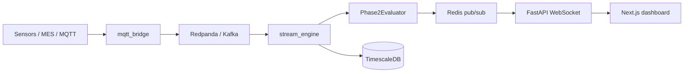
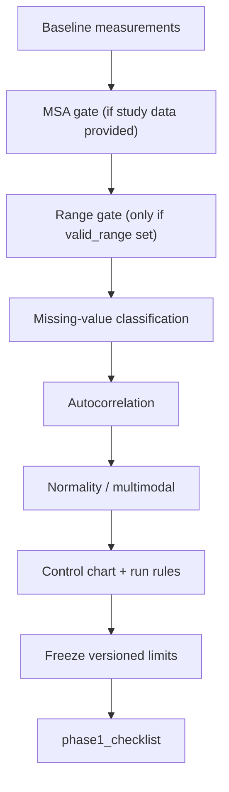

# Problem and solution

ASPC is a production Statistical Process Control platform for **batch and real-time** quality work. This page is for decision-makers and practitioners who need the *why* before the API reference.

Deep technical detail lives in [concepts](../concepts.md), [pipeline](../pipeline.md), and [deployment](../deployment.md). Quantitative evidence lives in [benchmarking](benchmarking.md).

## The problem

### Variation becomes cost

Every manufacturing process has variation. When that variation is *common-cause* (inherent to the process), you leave it alone. When it is *special-cause* (a shift, a broken sensor, a bad lot, an operator over-adjusting), you act — before scrap piles up, before a recall, before an FDA 483.

SPC is the discipline that separates the two. The chart is not a decoration; it is a decision tool with a defined false-alarm rate and a defined detection delay.

### What goes wrong with traditional tooling

| Pain | Why it hurts |
|------|----------------|
| **Batch-only analysis** | A mean shift that starts at 09:12 and is found in the 14:00 Excel export has already made hours of bad parts. |
| **Desktop-seat economics** | Proprietary SPC packages are excellent for an engineer at a desk and poor as a service your MES, PLC, or vision system can call. |
| **Incomplete “libraries”** | Many open-source chart snippets compute limits incorrectly, skip MSA, ignore missing data, or treat a disconnected sensor (`-999`) as a process signal. |
| **No freeze contract** | Recomputing limits every shift silently absorbs the shift into the “new normal.” Phase I and Phase II must be distinct. |
| **No go-live gate** | Shipping a chart live without MSA, normality, or multimodal checks is how you get pretty plots of stratified garbage. |

### The gap

Factories need SPC that is:

1. **Statistically correct** — AIAG SPC / MSA-4, ISO 7870, Wheeler where non-normal, Six Sigma capability routing.
2. **Operationally real-time** — stream observations against *frozen* limits, emit signals as they happen.
3. **Open and embeddable** — library, CLI, REST, WebSocket; MIT license; Docker Compose stack.
4. **Honest about bad data** — missing values classified, sentinels blanked **when `valid_range` is set**, multimodal STOP, empty input fails with a domain error.

That is the gap ASPC is built to fill.

## The solution

### Correct core

[`spc_core/`](../../spc_core/) is a pure statistics engine: Shewhart (I-MR, Xbar-R, Xbar-S, P, NP, C, U), EWMA, CUSUM, Nelson / Western Electric / Wheeler rulesets, Gage R&R, bias / linearity / stability, Cp/Cpk/Pp/Ppk with transform and nonparametric paths.

Every advertised `ChartType` has real math — no stubs. Correctness is exercised by a [55-case resilience catalog](../../resilience_data/) that asserts *which* rule fired and *which* gate status was set, not just “some signal count.”

### Gated Phase I before go-live

[`establish()`](../../spc_core/pipeline.py) runs a fixed gate sequence. Each gate returns `ok`, `warn`, or `stop`. A STOP (unacceptable MSA **when study data is supplied**, clear multimodality) blocks freezing limits for production use. A 10-item [`phase1_checklist()`](../../spc_core/pipeline.py) is the explicit go-live contract.

### Frozen, versioned limits for Phase II

Phase I produces content-hashed limit versions. Phase II ([`Phase2Evaluator`](../../spc_core/evaluator.py)) **never recomputes** those limits — batch replay and live streaming use the same object. That is the difference between “monitoring the process” and “absorbing the failure into the chart.”

### Real-time path

Compose stack, JWT / API-key auth, SSE replay, and Grafana ops are documented in [deployment](../deployment.md) and [api](../api.md).

### Open platform

MIT-licensed. Integrate as a Python library, CLI (`aspc`), or HTTP service. Persist with SQLite for embedded use or TimescaleDB for production streaming. The dashboard is a client — not the only way to consume signals.

## How it works

### Phase I: establish and freeze

Gates that look “always on” in the diagram are **not** all mandatory:

- **MSA** — runs when parts / operators / measurements are passed into `establish`. If omitted, the gate is `warn` and Phase I can still freeze.
- **Range** — runs only when `valid_range=(low, high)` is set. Without it, physical sentinels (e.g. `-999`) are not blanked automatically.

### Caller responsibilities

- Pass an MSA study into `establish` when measurement-system fitness must be allowed to **STOP** go-live.
- Pass `valid_range` when disconnected-sensor / out-of-physics readings must be treated as measurement failures, not process OOC.
- Treat `phase1_checklist()` as the explicit go-live contract; do not equate “chart plotted” with “ready for Phase II production.”

- **Attribute (count) data** skips Gaussian normality and Hartigan dip tests — those assume continuous distributions and would false-STOP in-control Poisson / binomial series.
- **Autocorrelated continuous series** route to EWMA or CUSUM; attribute charts stay on binomial / Poisson limits even if lag-1 ACF is elevated.
- **Non-normal after transform** takes the Wheeler path (points beyond 3σ only); subgroup structure is preserved.

### Phase II: evaluate against the freeze

New points are scored against the frozen `ControlLimits`. Signals carry rule ids (`1`…`8`, `WE1`…`WE4`). Primary and secondary panels (R / MR / S) are both evaluated when present.

### Where to go next

| If you need… | Read |
|--------------|------|
| Feature inventory and manufacturing scenarios | [capabilities](capabilities.md) |
| Concrete integration stories | [use-cases](use-cases.md) |
| Performance, accuracy, robustness numbers | [benchmarking](benchmarking.md) |
| Chart math and MSA rules | [concepts](../concepts.md) |
| Gate sequence and checklist | [pipeline](../pipeline.md) |

## Differentiators (summary)

| Concern | Typical desktop SPC | Typical open chart snippet | ASPC |
|---------|---------------------|----------------------------|------|
| Streaming Phase II | Rare | Absent | Built-in (Kafka / MQTT → engine) |
| Frozen limit versions | Often manual | Absent | Content-hashed, immutable eval |
| MSA STOP/WARN when study data is supplied | Study in a separate tool | Absent | Pipeline STOP / WARN **only if** MSA inputs are passed |
| Bad-data policy | Analyst judgment | Silent NaN / sentinel as OOC | Classified flags + range blanking |
| Embeddability | Seat license | Script | Library + REST + WebSocket |
| Proof of behavior | Proprietary validation | Often none | Resilience catalog + accuracy / perf benchmarks |
