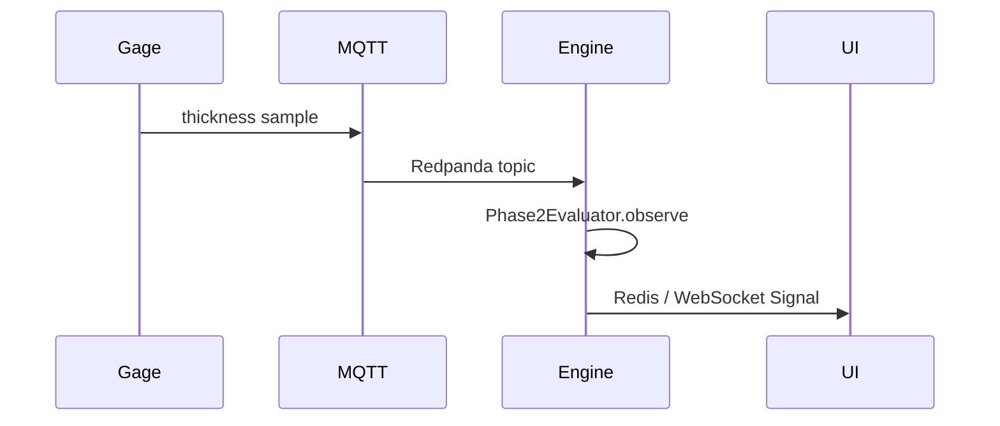

# Use cases

Three integration patterns that match what ASPC implements today. Numbers in the “outcome” sections are **illustrative scenarios** for planning discussions — not measured plant results and **not product SLAs**. Wire the same patterns; measure your own scrap saved and your own average run length (ARL) under your sampling rate and ruleset.

Detection delay is approximately a function of **sampling interval × ruleset ARL**, not a fixed “tens of seconds” guarantee from the software.

## 1. Automotive stamping — streaming I-MR

### Problem

Blank thickness drifts after a coil change. Downstream paint adhesion fails. An hourly CSV download from the PLC historian finds the shift late.

### Approach

1. Collect ≥ 25–50 in-control thickness readings from a stable coil; run `establish()` (or API Phase I). Pass physical `valid_range` **explicitly** so sensor sentinels are blanked — this is not automatic.
2. Pass MSA study inputs into `establish` (or run MSA first) if %GRR / NDC must be allowed to STOP go-live; omitting MSA only warns.
3. Freeze limits (`limits.version`); register the stream key and go-live.
4. Publish thickness over MQTT → mqtt_bridge → Redpanda → stream_engine → `Phase2Evaluator`.
5. Operators subscribe to WebSocket alerts; HMI shows the latest I and MR panels plus rule ids.

### Why ASPC fits

- Real-time Phase II against **frozen** limits (no silent limit refresh).
- Run rules catch sustained small shifts that never hit 3σ.
- Range gate keeps disconnected-sensor values out of the chart.

### Outcome (scenario)

If the process is sampled frequently enough for the chosen ruleset’s ARL, a mean shift can be flagged well before the next hourly batch review. Scrap avoided is a plant metric, not an ASPC SLA.

---

## 2. Pharmaceutical tablet weight — batch Xbar-R + capability

### Problem

Tablet weight is a critical quality attribute. Release needs documented capability (e.g. Cpk ≥ 1.33) and evidence the balance is fit for use.

### Approach

1. Run Gage R&R (parts × operators × trials) through `gage_rr_anova` / CLI MSA; gate resolution 10:1 vs tolerance.
2. Export lab balance CSV (subgroup id + weight).
3. `establish(..., chart_type="Xbar-R")` on Phase I lots; address STOP / WARN gates (missing, normality, multimodal).
4. `capability_analysis(weights, usl=..., lsl=...)` for the same study window; use transformed method if the weight distribution is skewed after filling.
5. Archive `limits.version`, capability report, and MSA outputs with the batch record.

### Why ASPC fits

- MSA is not a side spreadsheet — it can STOP go-live.
- Capability routing is explicit (parametric / transformed / nonparametric).
- CLI and library work offline (SQLite or files). Reports are **HTML/JSON**, not PDF.
- Suitable for engineering review and archival of `limits.version` + study outputs. Regulated CSV / 21 CFR Part 11 computer-system validation is **out of scope** for this product.

### Outcome (scenario)

Unacceptable %GRR caught before charting; after balance / method fix, Cpk meets the internal release threshold with versioned limits retained for audit.

---

## 3. Injection molding — attribute P chart streaming

### Problem

Flash defects appear in bursts. Operators adjust mold temperature on gut feel. Counts are not continuous measurements — Gaussian normality tests and dip tests would be the wrong tools.

### Approach

1. Vision system posts defectives and inspected count per lot via REST (`/streams/...` or ingest then Phase II).
2. Phase I builds a **P** chart with variable sample sizes; distribution gates are skipped for attribute data.
3. Freeze limits; Phase II evaluates each new lot. Prefer Western Electric or Nelson zone rules for “2 of 3 beyond 2σ” style detection.
4. Correlate signal timestamps with mold-temp PID logs in the MES (ASPC emits when; process engineering explains why).

### Why ASPC fits

- Proper binomial P limits, not “treat counts as I-MR.”
- Attribute path does not false-STOP on discrete dip artifacts.
- API + WebSocket fit a vision → quality service architecture without a desktop seat.

### Outcome (scenario)

Bursts of elevated defect rate generate repeatable signals; investigation ties them to PID oscillation rather than random “operator error.”

---

## Choosing a pattern

| Situation | Start with |
|-----------|------------|
| One sensor, continuous, live | Use case 1 (I-MR stream) |
| Lab / offline / regulated documentation | Use case 2 (batch + MSA + capability) |
| Defectives / defects from inspection | Use case 3 (P / NP / C / U) |
| Autocorrelated continuous sensor | Establish → EWMA or CUSUM route ([concepts](../concepts.md)) |

Next: [benchmarking](benchmarking.md) for measured performance and correctness evidence, or [deployment](../deployment.md) to stand up the Compose stack.
