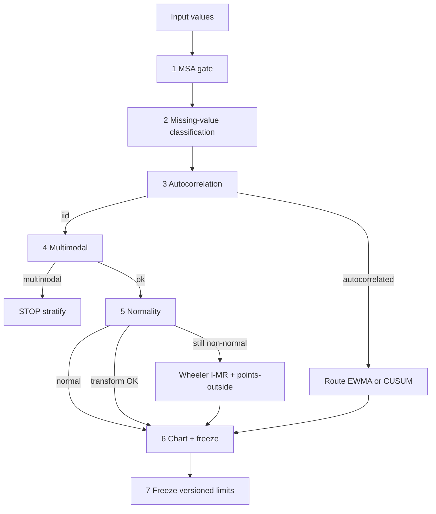

# Gated Phase I pipeline

Source: [`spc_core/pipeline.py`](../spc_core/pipeline.py).

The master entry point is `establish(...)`. It returns a `PipelineResult` with a chart, a list of `Gate` objects, optional MSA / normality / ACF / multimodal / transform details, a `stopped` flag, and a `chart_route`.

## Gate statuses

Each `Gate` has:

- `step` — name of the check
- `status` — `ok` | `warn` | `stop`
- `reason` — human-readable explanation
- `detail` — optional structured fields

`pipeline.stopped` is `True` if **any** gate has status `stop`. Callers (API go-live, operators) should refuse Phase II when stopped, even though a diagnostic chart may still be produced.

## Ordered steps



### 1. MSA (`step="msa"`, optional `gage_resolution`)

Runs only when `msa_parts`, `msa_operators`, and `msa_measurements` are provided.

- `%GRR > 30` or NDC < 5 → **stop**
- `10 ≤ %GRR < 30` → **warn**
- `%GRR < 10` and NDC ≥ 5 → **ok**
- If MSA inputs omitted → **warn** (“proceeding without measurement-system gate”)

Optional `gage_resolution` + `msa_tolerance` adds a `gage_resolution` gate via the 10:1 rule.

### 2. Missing values (`step="missing"`)

Uses `classify_missing`. Imputed (LOCF) and excluded reasons are counted; excluded rows produce a **warn**. No silent drops.

### 3. Autocorrelation (`step="autocorrelation"`)

`check_autocorrelation` vs `acf_threshold` (default 0.2). If autocorrelated → **warn** and route to `EWMA` or `CUSUM` (`autocorrelated_chart`, default `"EWMA"`).

### 4. Multimodal (`step="multimodal"`)

Skipped when already routed to EWMA/CUSUM. Multimodal → **stop** (stratify before SPC).

### 5. Normality / transform / Wheeler (`step="normality"`)

- Normal → **ok**
- Non-normal but transform restores normality → **ok**, `DistributionFlag.TRANSFORMED`
- Still non-normal → **warn**, Wheeler path: force `I-MR` + `ruleset="wheeler"`

### 6–7. Chart + freeze (`step="chart"`, `step="freeze"`)

`analyze_control_chart` with the resolved chart type and ruleset. Limits are frozen; `limits.version` is the content hash.

## `phase1_checklist()`

Ten go-live items (plus optional stratification fail):

| Item | Pass condition |
|------|----------------|
| `msa_grr_ndc` | MSA run and `%GRR < 10` and NDC ≥ 5 |
| `normality_path` | Normality gate ok/warn (or skipped for EWMA/CUSUM) |
| `autocorrelation` | ACF gate ran |
| `outliers_investigated` | Caller affirms investigation (`outliers_investigated=True`) |
| `missing_classified` | Missing gate ok/warn |
| `min_subgroups` | Plotted points ≥ `min_subgroups` (default 25) |
| `limits_frozen` | Version hash present |
| `transform_documented` | Transform label set when flag is TRANSFORMED |
| `gage_calibration` | Caller affirms active calibration |
| `phase2_enabled` | Caller affirms Phase II monitoring is on |

Returns `{passed, items, limits_version, stopped, msa_ok}`.

## Per-point `SPCRecord`

`ControlChartResult.to_records()` emits one record per plotted point:

| Field | Meaning |
|-------|---------|
| `measurement_value` | Plotted statistic |
| `data_quality_flag` | Provenance (`QualityFlag`) |
| `distribution_flag` | How distribution was handled |
| `transform_applied` | Label if transformed |
| `phase` | `PHASE_I` or `PHASE_II` |
| `ucl` / `lcl` / `centerline` | Limits used for this point |
| `signals` | List of `Signal` (rule_id, index, description, …) |
| `gage_id` / `machine_id` | Optional context |
| `subgroup_id` / `timestamp` | Optional identity |

`SPCReport.from_chart_result(..., include_records=True, gates=..., checklist=...)` packages chart + gates + checklist for API/CLI persistence.

## Minimal usage

```python
from sample_data import spc_individual
from spc_core import establish, phase1_checklist

cols = spc_individual(in_control=True)
pipe = establish(cols["measurement"])
print(pipe.chart.chart_type, pipe.limits_version, pipe.stopped)
for g in pipe.gates:
    print(g.status, g.step, g.reason)

checklist = phase1_checklist(pipe, phase2_enabled=False)
print(checklist["passed"], checklist["items"])

records = pipe.chart.to_records()
```

Next: [CLI](cli.md) · [Python API](python-api.md) · [Concepts](concepts.md)
